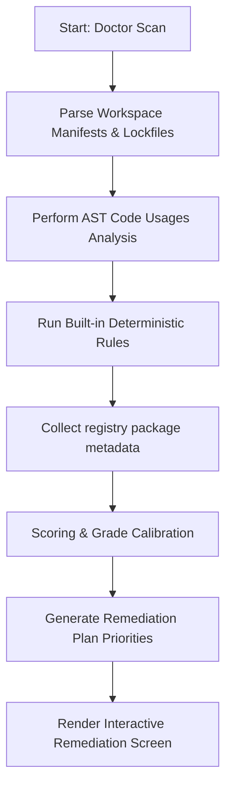

# The Doctor Diagnostic & Remediation Engine

This guide details the core logic behind the `pkg-ct doctor` command, rule scanning, prioritization, and self-healing action plans.

---

## 1. Diagnostic Architecture

When running `pkg-ct doctor`, the tool executes a comprehensive evaluation pipeline:



---

## 2. Priority Queue & Action Recommendations

Rather than listing findings in alphabetical order, `doctor` filters and ranks issues dynamically using the **Remediation Priority Score**:

$$\text{Priority Score} = \text{Severity Weight} \times \text{Exposure Factor} \times \text{Fix Confidence}$$

### Scoring Factors

1. **Severity Weight:**
   * Critical: `2.0`
   * High: `1.5`
   * Medium: `1.0`
   * Low: `0.5`
2. **Exposure Factor (Production vs Development):**
   * Production Critical: `1.5`
   * Production Reachable: `1.2`
   * Build Only / Dev Only: `0.8`
3. **Fix Confidence:**
   * Heuristic/API certainty metric ranging from `0.1` to `1.0`.

Findings with the highest score are placed at the top of the **🏆 TOP ACTIONS** list.

---

## 3. Heuristic Remediation Rules

The doctor engine suggests specific, actionable commands based on findings:

### Duplicate Package Deduplication
* **Finding:** Multiple minor/patch versions of package X are installed.
* **Remediation:** If the ranges are overlapping, suggests:
  ```bash
  npm dedupe
  ```
  If ranges do not overlap (major drift), suggests aligning versions in `package.json` to standardise on a single version range.

### Missing Dependencies
* **Finding:** Package Y is imported in source code but missing from `package.json`.
* **Remediation:** Runs a check to determine if it is used in production files or test files. Suggests:
  * For production usage: `npm install Y`
  * For dev-only usage: `npm install --save-dev Y`

### Unused Declared Dependencies
* **Finding:** Package Z is declared in `package.json` but usage confidence is below `30`.
* **Remediation:** Evaluates the safe removal probability. If high, recommends:
  ```bash
  npm uninstall Z
  ```

---

## 4. Execution Mode: Interactive vs CI

The doctor supports two main environments:

* **Interactive Mode (Default):** Runs an interactive terminal prompt where developers can review findings, drill down into dependencies, and choose to execute the suggested fix scripts on the fly.
* **CI Mode (`--ci`):** Disables interactive prompts and spinner animations, running checks deterministically and writing findings directly to standard out or markdown reports.
